<a id="top"></a>

# Task Manager — FastAPI + Streamlit

> Complete guide to set up, run, and test a full-stack CRUD project built with **FastAPI** (backend) and **Streamlit** (frontend).

---

## Table of Contents

| # | Section |
|---|---|
| 1 | [Project Overview](#s1) |
| 2 | [Project Structure](#s2) |
| 3 | [Virtual Environment — Create & Activate](#s3) |
| 3a | &nbsp;&nbsp;&nbsp;↳ [Windows](#s3) |
| 3b | &nbsp;&nbsp;&nbsp;↳ [macOS](#s3) |
| 3c | &nbsp;&nbsp;&nbsp;↳ [Linux Ubuntu 22.04](#s3) |
| 4 | [Install Dependencies](#s4) |
| 5 | [Run the FastAPI Server](#s5) |
| 6 | [Run the Streamlit Interface](#s6) |
| 7 | [API Endpoints — Complete Reference](#s7) |
| 7a | &nbsp;&nbsp;&nbsp;↳ [GET — Read tasks](#s7) |
| 7b | &nbsp;&nbsp;&nbsp;↳ [POST — Create a task](#s7) |
| 7c | &nbsp;&nbsp;&nbsp;↳ [PUT — Replace a task entirely](#s7) |
| 7d | &nbsp;&nbsp;&nbsp;↳ [PATCH — Partial update](#s7) |
| 7e | &nbsp;&nbsp;&nbsp;↳ [DELETE — Remove a task](#s7) |
| 8 | [Test with VS Code REST Client](#s8) |
| 9 | [Test with Postman](#s9) |
| 10 | [Test with curl](#s10) |
| 11 | [How the Streamlit UI Works](#s11) |
| 12 | [Troubleshooting](#s12) |

---

<a id="s1"></a>

<details>
<summary>1 - Project Overview</summary>

<br/>

This project is a minimal full-stack application that demonstrates all five core HTTP methods of a REST API:

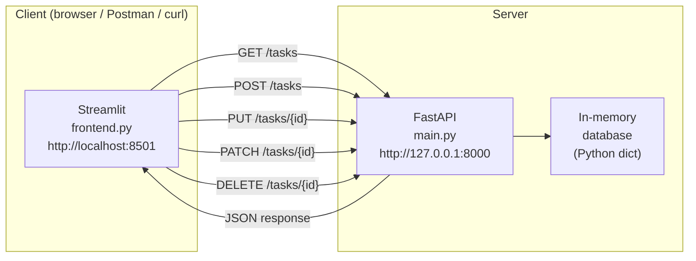

The **FastAPI** backend exposes a `/tasks` API that supports full CRUD operations. The **Streamlit** frontend provides a visual interface to interact with that API without writing any code. Both communicate over HTTP using the `requests` library.

---

### What is a Task?

Each task is a JSON object with the following fields:

```json
{
  "id": 1,
  "title": "Learn FastAPI",
  "description": "Read the official documentation",
  "completed": false,
  "priority": "high",
  "created_at": "2026-03-19 08:00:00"
}
```

| Field | Type | Required | Default |
|---|---|---|---|
| `id` | integer | assigned by server | — |
| `title` | string | yes | — |
| `description` | string | no | `""` |
| `completed` | boolean | no | `false` |
| `priority` | string | no | `"medium"` |
| `created_at` | string | assigned by server | — |

Valid values for `priority`: `"low"`, `"medium"`, `"high"`

</details>

<p align="right"><a href="#top">↑ Back to top</a></p>

---

<a id="s2"></a>

<details>
<summary>2 - Project Structure</summary>

<br/>

```text
mini_fastapi/
│
├── main.py              ← FastAPI server — all CRUD endpoints
├── frontend.py          ← Streamlit web interface
├── requirements.txt     ← Python dependencies with versions
├── test_api.http        ← VS Code REST Client test requests
├── curl_examples.sh     ← curl and PowerShell test commands
└── README.md            ← this file
```

---

### Responsibilities of each file

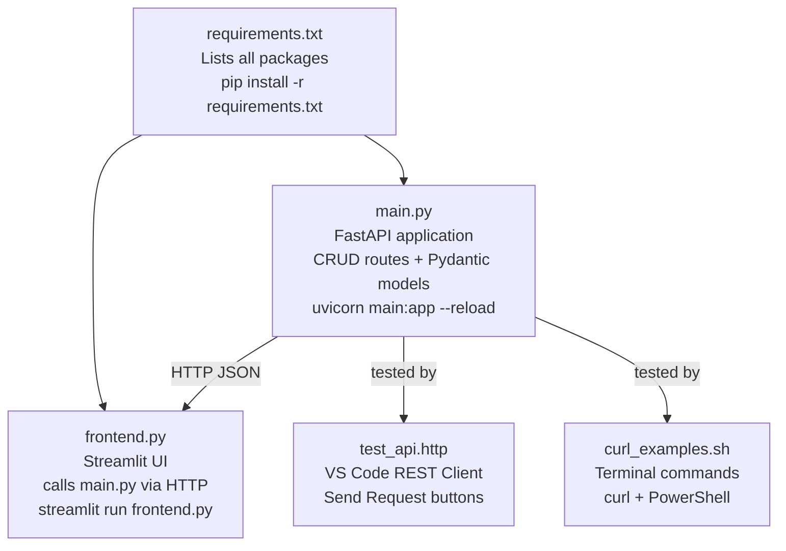

</details>

<p align="right"><a href="#top">↑ Back to top</a></p>

---

<a id="s3"></a>

<details>
<summary>3 - Virtual Environment — Create & Activate</summary>

<br/>

A virtual environment isolates your project's packages from the rest of the system. This guarantees that the exact versions in `requirements.txt` are used and nothing conflicts with other projects.

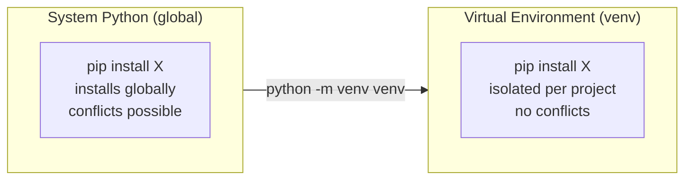

---

### Windows

```powershell
# 1. Navigate into the project folder
cd mini_fastapi

# 2. Create the virtual environment
python -m venv venv

# 3. Activate it — your prompt changes to (venv)
venv\Scripts\activate

# 4. Verify: Python now points to the venv folder
where python
# Expected: C:\...\mini_fastapi\venv\Scripts\python.exe
```

> If you get `running scripts is disabled`, run this once in PowerShell as administrator:
> ```powershell
> Set-ExecutionPolicy -ExecutionPolicy RemoteSigned -Scope CurrentUser
> ```

---

### macOS

```bash
# 1. Navigate into the project folder
cd mini_fastapi

# 2. Create the virtual environment
python3 -m venv venv

# 3. Activate it — your prompt changes to (venv)
source venv/bin/activate

# 4. Verify
which python
# Expected: /Users/yourname/mini_fastapi/venv/bin/python
```

---

### Linux — Ubuntu 22.04

```bash
# 0. Install venv support if missing (one-time)
sudo apt update
sudo apt install -y python3 python3-pip python3-venv

# 1. Navigate into the project folder
cd mini_fastapi

# 2. Create the virtual environment
python3 -m venv venv

# 3. Activate it
source venv/bin/activate

# 4. Verify
which python
# Expected: /home/yourname/mini_fastapi/venv/bin/python
```

---

### VS Code — auto-activate

1. Open VS Code: `code .` from inside `mini_fastapi/`
2. Press `Ctrl+Shift+P` → `Python: Select Interpreter`
3. Choose the Python inside `venv/`
4. Every new VS Code terminal will activate the venv automatically

---

### Summary

| Action | Windows | macOS / Linux |
|---|---|---|
| Create | `python -m venv venv` | `python3 -m venv venv` |
| Activate | `venv\Scripts\activate` | `source venv/bin/activate` |
| Verify | `where python` | `which python` |
| Deactivate | `deactivate` | `deactivate` |

</details>

<p align="right"><a href="#top">↑ Back to top</a></p>

---

<a id="s4"></a>

<details>
<summary>4 - Install Dependencies</summary>

<br/>

> Make sure the virtual environment is activated before running these commands. You will see `(venv)` in your prompt.

```bash
# Upgrade pip first (good practice)
python -m pip install --upgrade pip

# Install all dependencies listed in requirements.txt
pip install -r requirements.txt

# Verify what was installed
pip list
```

---

### What gets installed

| Package | Version | Purpose |
|---|---|---|
| `fastapi` | 0.115.0 | Web framework for building the API |
| `uvicorn` | 0.30.1 | ASGI server that runs the FastAPI app |
| `pydantic` | 2.7.4 | Data validation for request bodies |
| `streamlit` | 1.35.0 | Web UI framework for the frontend |
| `requests` | 2.31.0 | HTTP client used by the Streamlit frontend |

---

### Install a single package manually

```bash
pip install fastapi          # latest version
pip install fastapi==0.115.0 # specific version
```

### Save current dependencies to file

```bash
pip freeze > requirements.txt
```

</details>

<p align="right"><a href="#top">↑ Back to top</a></p>

---

<a id="s5"></a>

<details>
<summary>5 - Run the FastAPI Server</summary>

<br/>

```bash
uvicorn main:app --reload
```

| Part | Meaning |
|---|---|
| `uvicorn` | The ASGI server |
| `main` | The filename `main.py` (without `.py`) |
| `:app` | The `FastAPI()` instance variable inside `main.py` |
| `--reload` | Auto-restarts when you save a file change |

---

### Server startup output

```text
INFO:     Uvicorn running on http://127.0.0.1:8000 (Press CTRL+C to quit)
INFO:     Started reloader process [12345]
INFO:     Started server process [12346]
INFO:     Waiting for application startup.
INFO:     Application startup complete.
```

---

### Where to access the API

| URL | What you see |
|---|---|
| `http://127.0.0.1:8000/` | Root — confirms the API is running |
| `http://127.0.0.1:8000/tasks` | All tasks (JSON) |
| `http://127.0.0.1:8000/docs` | Swagger UI — interactive documentation |
| `http://127.0.0.1:8000/redoc` | ReDoc — clean read-only docs |

---

### Request flow inside FastAPI

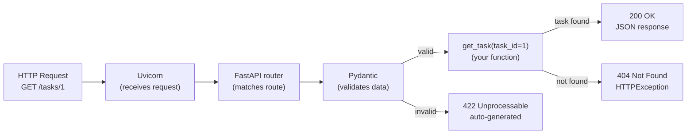

---

### Stop the server

```bash
Ctrl + C
```

---

### Other useful options

```bash
# Different port
uvicorn main:app --reload --port 8080

# Accept connections from other machines
uvicorn main:app --reload --host 0.0.0.0

# Without auto-reload (production-like)
uvicorn main:app --workers 2
```

</details>

<p align="right"><a href="#top">↑ Back to top</a></p>

---

<a id="s6"></a>

<details>
<summary>6 - Run the Streamlit Interface</summary>

<br/>

Open a **second terminal**, activate the venv again, then:

```bash
# Windows
venv\Scripts\activate
streamlit run frontend.py

# macOS / Linux
source venv/bin/activate
streamlit run frontend.py
```

Streamlit opens automatically at `http://localhost:8501`

> The FastAPI server must already be running in the first terminal. Both must stay open simultaneously.

---

### Two terminals side by side

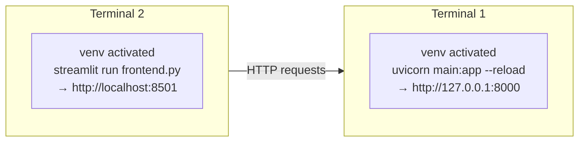

In VS Code, open a second terminal with the `+` button in the terminal panel or `Ctrl+Shift+5`.

---

### Streamlit startup output

```text
You can now view your Streamlit app in your browser.

  Local URL: http://localhost:8501
  Network URL: http://192.168.x.x:8501
```

---

### Stop Streamlit

```bash
Ctrl + C
```

</details>

<p align="right"><a href="#top">↑ Back to top</a></p>

---

<a id="s7"></a>

<details>
<summary>7 - API Endpoints — Complete Reference</summary>

<br/>

### Overview

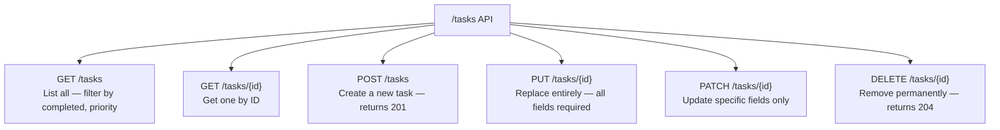

---

### GET — Read tasks

**Get all tasks:**

```http
GET http://127.0.0.1:8000/tasks
```

**Filter by status:**

```http
GET http://127.0.0.1:8000/tasks?completed=true
GET http://127.0.0.1:8000/tasks?completed=false
```

**Filter by priority:**

```http
GET http://127.0.0.1:8000/tasks?priority=high
```

**Combine filters:**

```http
GET http://127.0.0.1:8000/tasks?completed=false&priority=high
```

**Get one task by ID:**

```http
GET http://127.0.0.1:8000/tasks/1
```

Expected response (200 OK):
```json
{
  "id": 1,
  "title": "Learn FastAPI",
  "description": "Read the official documentation",
  "completed": false,
  "priority": "high",
  "created_at": "2026-03-19 08:00:00"
}
```

If the task does not exist → **404 Not Found**:
```json
{ "detail": "Task with ID 999 not found" }
```

---

### POST — Create a task

```http
POST http://127.0.0.1:8000/tasks
Content-Type: application/json

{
  "title": "Study Pydantic",
  "description": "Learn data validation",
  "priority": "high",
  "completed": false
}
```

Only `title` is required. All other fields have defaults.

Expected response (**201 Created**):
```json
{
  "id": 5,
  "title": "Study Pydantic",
  "description": "Learn data validation",
  "completed": false,
  "priority": "high",
  "created_at": "2026-03-19 14:30:00"
}
```

If `title` is missing → **422 Unprocessable Entity**:
```json
{
  "detail": [
    {
      "type": "missing",
      "loc": ["body", "title"],
      "msg": "Field required"
    }
  ]
}
```

---

### PUT — Replace a task entirely

```http
PUT http://127.0.0.1:8000/tasks/1
Content-Type: application/json

{
  "title": "Learn FastAPI — UPDATED",
  "description": "Read docs AND build a real project",
  "completed": true,
  "priority": "high"
}
```

All fields must be provided. PUT replaces the entire task — any missing field is reset to its default.

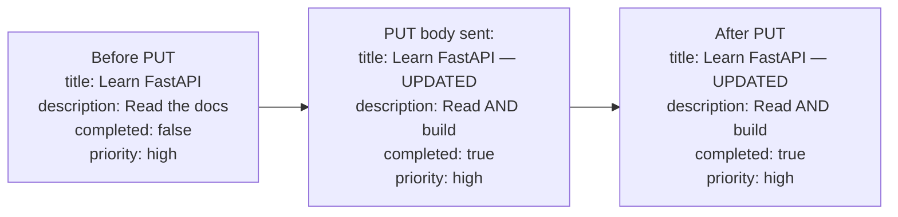

---

### PATCH — Partial update

```http
PATCH http://127.0.0.1:8000/tasks/3
Content-Type: application/json

{
  "completed": true
}
```

Only the provided fields are updated. Everything else stays unchanged.

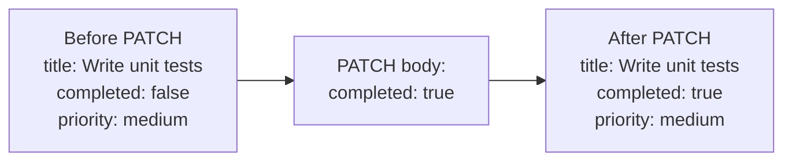

| Method | Fields required | Effect on missing fields |
|---|---|---|
| PUT | All fields | Reset to default |
| PATCH | Only what changes | Left unchanged |

---

### DELETE — Remove a task

```http
DELETE http://127.0.0.1:8000/tasks/4
```

Expected response: **204 No Content** — empty body.

If the task does not exist → **404 Not Found**.

---

### HTTP status codes used in this project

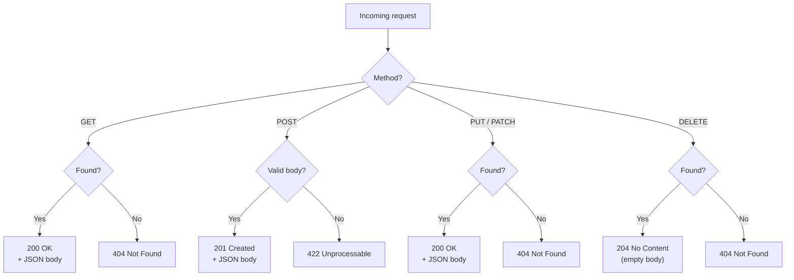

</details>

<p align="right"><a href="#top">↑ Back to top</a></p>

---

<a id="s8"></a>

<details>
<summary>8 - Test with VS Code REST Client</summary>

<br/>

The file `test_api.http` contains ready-to-use requests for the **REST Client** extension in VS Code.

### Setup

1. Open VS Code
2. Go to Extensions (`Ctrl+Shift+X`)
3. Search: `REST Client` — install the one by **Humao** (id: `humao.rest-client`)
4. Open `test_api.http`

### How to send a request

Each block is separated by `###`. A **Send Request** link appears above each block:

```
### GET — All tasks          ← click "Send Request" here
GET http://127.0.0.1:8000/tasks
Accept: application/json
```

The response appears in a split panel on the right showing the status code, headers, and JSON body.

---

### What the file covers

| Block | Method | URL | Expected result |
|---|---|---|---|
| Root check | GET | `/` | 200 — API info |
| All tasks | GET | `/tasks` | 200 — list of 4 tasks |
| Filter completed | GET | `/tasks?completed=true` | 200 — filtered list |
| Filter priority | GET | `/tasks?priority=high` | 200 — filtered list |
| Single task | GET | `/tasks/1` | 200 — task object |
| Not found | GET | `/tasks/999` | 404 |
| Create full | POST | `/tasks` | 201 — new task |
| Create minimal | POST | `/tasks` | 201 — defaults applied |
| Missing title | POST | `/tasks` | 422 — validation error |
| Wrong type | POST | `/tasks` | 422 — validation error |
| Replace entirely | PUT | `/tasks/1` | 200 — updated task |
| Mark completed | PATCH | `/tasks/3` | 200 — updated task |
| Change priority | PATCH | `/tasks/4` | 200 — updated task |
| Delete | DELETE | `/tasks/4` | 204 — no body |
| Verify deleted | GET | `/tasks/4` | 404 |

</details>

<p align="right"><a href="#top">↑ Back to top</a></p>

---

<a id="s9"></a>

<details>
<summary>9 - Test with Postman</summary>

<br/>

Download: https://www.postman.com/downloads/

---

### GET — All tasks

```text
Method: GET
URL:    http://127.0.0.1:8000/tasks
Send
```

---

### GET — With filters

```text
Method: GET
URL:    http://127.0.0.1:8000/tasks

Params tab:
  KEY         VALUE
  completed   false
  priority    high

→ URL becomes: /tasks?completed=false&priority=high
```

---

### POST — Create a task

```text
Method: POST
URL:    http://127.0.0.1:8000/tasks

Body tab → raw → JSON:
{
  "title": "New task from Postman",
  "description": "Testing POST",
  "priority": "high",
  "completed": false
}

Expected status: 201 Created
```

---

### PUT — Full replacement

```text
Method: PUT
URL:    http://127.0.0.1:8000/tasks/1

Body tab → raw → JSON:
{
  "title": "Updated title",
  "description": "Updated description",
  "completed": true,
  "priority": "high"
}

Expected status: 200 OK
```

---

### PATCH — Mark as completed

```text
Method: PATCH
URL:    http://127.0.0.1:8000/tasks/3

Body tab → raw → JSON:
{
  "completed": true
}

Expected status: 200 OK
```

---

### DELETE — Remove a task

```text
Method: DELETE
URL:    http://127.0.0.1:8000/tasks/4

Expected status: 204 No Content (empty body)
```

---

### Swagger UI (no Postman needed)

Open `http://127.0.0.1:8000/docs` in your browser.
Click any endpoint → **Try it out** → fill in values → **Execute**.
The response appears directly below including the status code and body.

</details>

<p align="right"><a href="#top">↑ Back to top</a></p>

---

<a id="s10"></a>

<details>
<summary>10 - Test with curl</summary>

<br/>

curl is available by default on Windows 10+, macOS, and Linux.

---

### GET

```bash
# All tasks
curl http://127.0.0.1:8000/tasks

# With filter
curl "http://127.0.0.1:8000/tasks?completed=false&priority=high"

# Single task
curl http://127.0.0.1:8000/tasks/1

# Not found
curl http://127.0.0.1:8000/tasks/999
```

---

### POST

```bash
curl -X POST http://127.0.0.1:8000/tasks \
     -H "Content-Type: application/json" \
     -d '{"title": "curl task", "priority": "high"}'
```

---

### PUT

```bash
curl -X PUT http://127.0.0.1:8000/tasks/1 \
     -H "Content-Type: application/json" \
     -d '{"title": "Replaced title", "description": "Full replace", "completed": true, "priority": "high"}'
```

---

### PATCH

```bash
curl -X PATCH http://127.0.0.1:8000/tasks/3 \
     -H "Content-Type: application/json" \
     -d '{"completed": true}'
```

---

### DELETE

```bash
curl -X DELETE http://127.0.0.1:8000/tasks/4
# No body returned — 204 No Content
```

---

### Windows PowerShell

```powershell
# GET all
Invoke-RestMethod -Uri "http://127.0.0.1:8000/tasks" -Method GET | ConvertTo-Json

# POST
Invoke-RestMethod -Uri "http://127.0.0.1:8000/tasks" `
  -Method POST `
  -ContentType "application/json" `
  -Body '{"title": "PowerShell task", "priority": "medium"}' | ConvertTo-Json

# PATCH
Invoke-RestMethod -Uri "http://127.0.0.1:8000/tasks/3" `
  -Method PATCH `
  -ContentType "application/json" `
  -Body '{"completed": true}' | ConvertTo-Json

# DELETE
Invoke-RestMethod -Uri "http://127.0.0.1:8000/tasks/4" -Method DELETE
```

</details>

<p align="right"><a href="#top">↑ Back to top</a></p>

---

<a id="s11"></a>

<details>
<summary>11 - How the Streamlit UI Works</summary>

<br/>

The Streamlit frontend is a separate Python process that calls the FastAPI server using the `requests` library. It does not connect to the database directly — it always goes through the API.

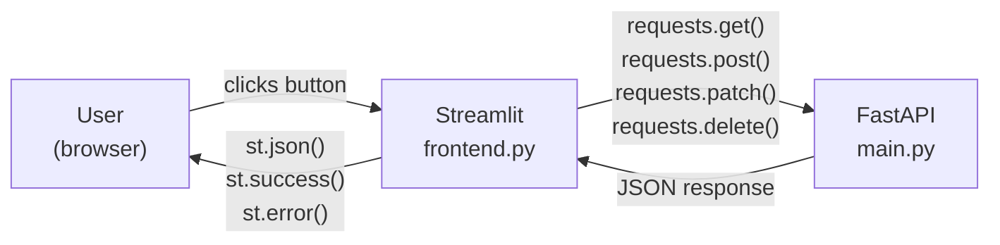

---

### The four pages

| Page | HTTP method used | What it does |
|---|---|---|
| View all tasks | `GET /tasks` | Lists tasks with expanders, supports filters |
| Create a task | `POST /tasks` | Form → sends JSON body → shows 201 response |
| Edit a task | `PUT` or `PATCH` | Selector → choose mode → save changes |
| Delete a task | `DELETE /tasks/{id}` | Selector → confirm → sends DELETE request |

---

### Edit page — PUT vs PATCH

The Edit page lets you choose the update mode:

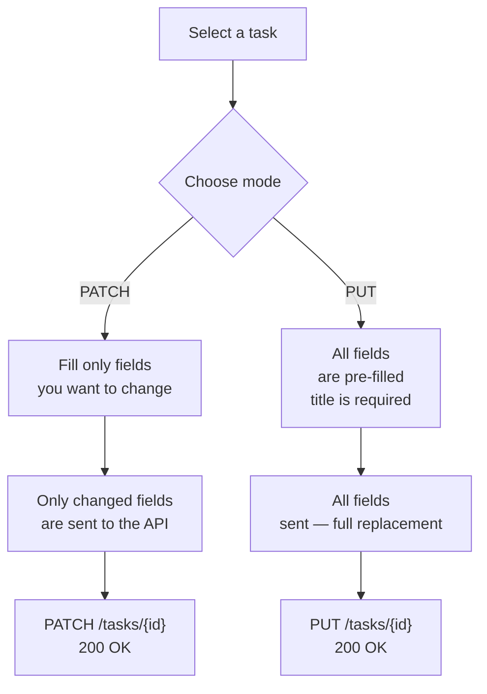

---

### Server not running — error message

If the FastAPI server is not running when you open the Streamlit app, it displays:

```text
Cannot reach the FastAPI server at http://127.0.0.1:8000
Start it first: uvicorn main:app --reload
```

The app then stops — no further rendering occurs until the backend is available.

</details>

<p align="right"><a href="#top">↑ Back to top</a></p>

---

<a id="s12"></a>

<details>
<summary>12 - Troubleshooting</summary>

<br/>

### `python` is not recognized (Windows)

```text
Error: 'python' is not recognized as an internal or external command
```

Fix: use `py` instead, or reinstall Python and check **Add Python to PATH**.

```powershell
py --version
py -m venv venv
```

---

### `running scripts is disabled` (Windows PowerShell)

```text
venv\Scripts\activate.ps1 cannot be loaded because running scripts is disabled
```

Fix — run once in PowerShell:
```powershell
Set-ExecutionPolicy -ExecutionPolicy RemoteSigned -Scope CurrentUser
```

---

### `ModuleNotFoundError: No module named 'fastapi'`

The virtual environment is not activated.

```bash
# Windows
venv\Scripts\activate

# macOS / Linux
source venv/bin/activate

# Then install
pip install -r requirements.txt
```

---

### Port 8000 already in use

```text
ERROR: [Errno 98] Address already in use
```

Fix:
```bash
# Use a different port
uvicorn main:app --reload --port 8001

# Or kill the process using port 8000
# Windows
netstat -ano | findstr :8000
taskkill /PID <PID> /F

# macOS / Linux
lsof -ti:8000 | xargs kill -9
```

---

### Streamlit cannot reach FastAPI

```text
Cannot reach the FastAPI server at http://127.0.0.1:8000
```

Fix: start the FastAPI server in a separate terminal first.

```bash
uvicorn main:app --reload
```

---

### 422 Unprocessable Entity

```json
{ "detail": [{ "type": "missing", "loc": ["body", "title"], "msg": "Field required" }] }
```

Fix: `title` is required in the POST body.

```json
{ "title": "My task" }
```

---

### 404 Not Found

```json
{ "detail": "Task with ID 999 not found" }
```

Fix: use an existing ID. Call `GET /tasks` first to see available IDs.

</details>

<p align="right"><a href="#top">↑ Back to top</a></p>

---

<p align="center">
  <strong>End of README</strong><br/>
  <a href="#top">↑ Back to the top</a>
</p>
